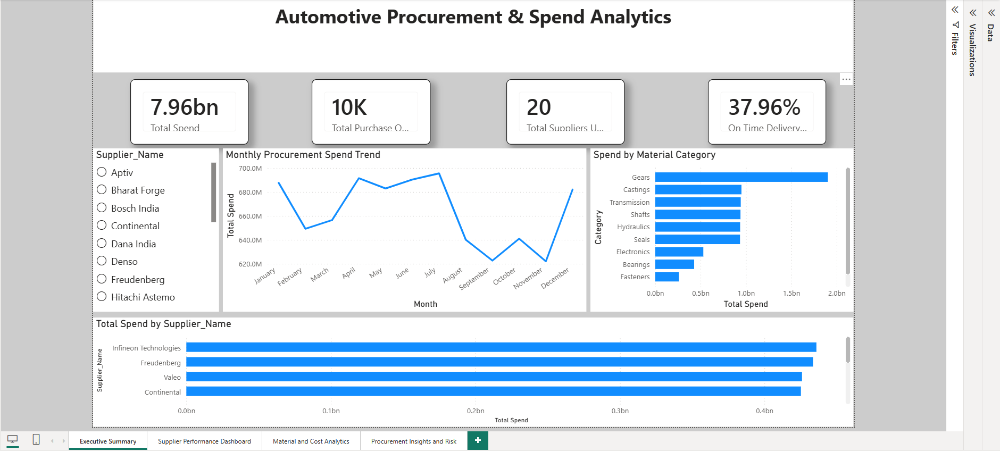
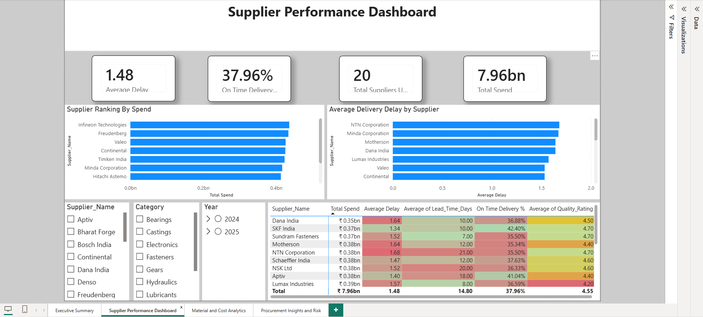
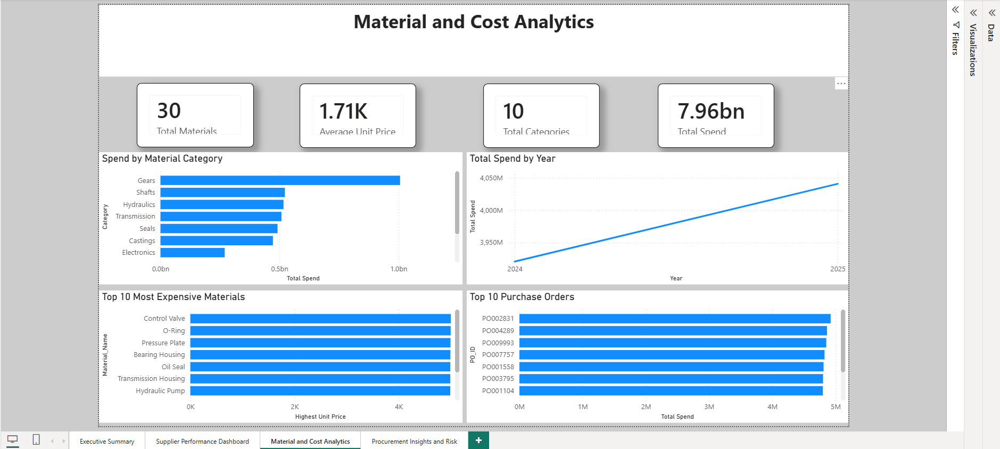
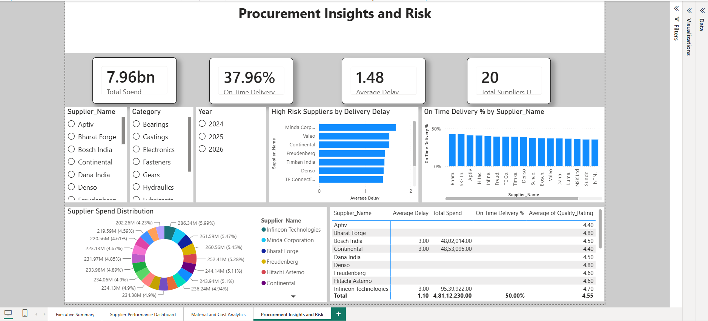

# Automotive Procurement & Spend Analytics Dashboard

## Project Overview

Procurement plays a critical role in the automotive manufacturing industry, directly impacting production costs, supplier performance, and overall profitability. Manufacturing organizations procure thousands of components from multiple suppliers across different regions, making it essential to monitor spending patterns and supplier efficiency.

This project develops an interactive Procurement & Spend Analytics Dashboard that provides end-to-end visibility into procurement operations, supplier performance, spending trends, and potential cost optimization opportunities.

The dashboard is designed to simulate a real-world automotive manufacturing environment and demonstrates how data analytics can support strategic procurement decisions.

---

## Business Problem

The procurement team faces several challenges:

* Lack of visibility into procurement spending
* Difficulty identifying high-cost suppliers
* Limited tracking of supplier delivery performance
* Inability to monitor procurement risks and supplier dependency
* Lack of data-driven insights for cost optimization

The objective of this project is to build a centralized analytics solution that enables procurement managers to make informed decisions and improve supply chain efficiency.

---

## Project Objectives

* Analyze procurement spending across suppliers and material categories.
* Monitor supplier performance and delivery reliability.
* Identify procurement cost-saving opportunities.
* Evaluate supplier dependency and procurement risks.
* Build interactive dashboards for management reporting.

---

## Industry Context

The project simulates procurement activities of an automotive component manufacturing company that purchases materials such as:

* Bearings
* Gears
* Shafts
* Electronic Control Units (ECUs)
* Sensors
* Fasteners
* Lubricants
* Packaging Materials

---

## Dataset

The project uses a synthetic dataset that mimics real procurement operations and consists of:

### Purchase Orders

* Purchase Order ID
* Order Date
* Supplier ID
* Material ID
* Quantity Ordered
* Unit Price
* Total Cost

### Suppliers

* Supplier Information
* Country
* Lead Time
* Quality Rating

### Materials

* Material Details
* Material Category

### Deliveries

* Promised Date
* Delivery Date
* Delay Information

---

Suppliers -------- Purchase_Orders -------- Materials
                         |
                         |
                    Deliveries

Plants -------- Purchase_Requisitions -------- Materials


## Key Performance Indicators (KPIs)

### Procurement KPIs

* Total Procurement Spend
* Monthly Spend Trend
* Spend by Supplier
* Spend by Material Category
* Average Purchase Price

### Supplier Performance KPIs

* On-Time Delivery Percentage
* Average Delivery Delay
* Supplier Quality Rating
* Supplier Lead Time

### Cost Optimization KPIs

* Price Variance
* Supplier Spend Concentration
* Savings Opportunities
* Procurement Risk Score

---

## Dashboard Pages

### Executive Summary

* Procurement spend overview
* Monthly spend trends
* Category-wise spending

### Supplier Performance Dashboard

* Supplier scorecards
* Delivery performance
* Quality analysis

### Cost Analytics Dashboard

* Price comparison
* Savings opportunities
* Procurement efficiency metrics

### Procurement Risk Dashboard

* Supplier dependency analysis
* Delayed suppliers
* Geographic risk analysis

---

## Technology Stack

* Microsoft Excel
* SQL Server 2022 Express
* SQL Server Management Studio (SSMS)
* SQL
* Power BI Desktop
* DAX (Data Analysis Expressions)
* Power Query
* Git
* GitHub
* Visual Studio Code

---

## Repository Structure

```
automotive-procurement-spend-analytics
│
├── data
│   ├── Suppliers.csv
│   ├── Materials.csv
│   ├── Purchase_Orders.csv
│   └── Deliveries.csv
│
├── sql
│   ├── exploratory_analysis.sql
│   ├── procurement_kpis.sql
│   └── supplier_performance.sql
│
├── powerbi
│   └── Automotive_Procurement_Analytics.pbix
│
├── screenshots
│   ├── page1_executive_summary.png
│   ├── page2_supplier_performance_dashboard.png
│   ├── page3_material_and_cost_analytics.png
│   └── page4_procurement_insights_and_risk.png
│
└── README.md
```

---

## Skills Demonstrated

* Data Cleaning and Transformation
* Data Modeling
* SQL Analytics
* DAX Calculations
* Dashboard Design
* Procurement Analytics
* Supply Chain Analytics
* Business Intelligence Reporting

---

## SQL Concepts Used

* SELECT Statements
* INNER JOINs
* Aggregate Functions (SUM, AVG, COUNT)
* GROUP BY
* ORDER BY
* Window Functions (RANK)
* CASE Statements
* DISTINCT
* CAST
* Date Functions (YEAR, MONTH)

## Power BI Features Used

* Data Modeling
* Relationship Management
* DAX Measures
* KPI Cards
* Clustered Bar Charts
* Line Charts
* Donut Charts
* Matrix Visuals
* Interactive Slicers
* Conditional Formatting
* Cross-Filtering

## Project Workflow

1. Generate realistic automotive procurement datasets.
2. Clean and transform procurement data.
3. Build SQL analysis queries.
4. Design data model in Power BI.
5. Create interactive dashboards and KPIs.
6. Document findings and business recommendations.

---

## Expected Business Outcomes

* Improved visibility into procurement spending.
* Better supplier performance monitoring.
* Identification of cost reduction opportunities.
* Reduced procurement risks.
* Data-driven decision making for strategic sourcing.

---

# Dashboard Preview

## Executive Procurement Dashboard



---

## Supplier Performance Dashboard



---

## Material & Cost Analytics



---

## Procurement Insights & Risk



---

## Future Enhancements

* Supplier Risk Prediction using Machine Learning.
* Procurement Cost Forecasting.
* Inventory Integration.
* Automated Data Refresh Pipeline.
* Supplier Performance Alert System.
